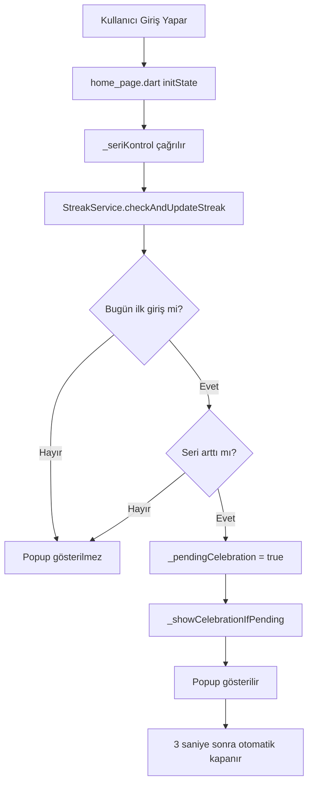

# Seri Kutlama Popup Dokümantasyonu

Bu doküman, seri kutlama popup'ının ne zaman ve nasıl çalıştığını detaylı olarak açıklar.

---

## 📋 Genel Bakış

Seri kutlama popup'ı, kullanıcının günlük serisi arttığında ekranda büyük bir Fire.json animasyonu ve tebrik mesajı gösterir. Popup **sadece ana 3 sayfada** (Araçlar, Dashboard, Profil) gösterilir.

---

## 🔄 Çalışma Akışı



---

## 🎯 Popup Ne Zaman Gösterilir?

### ✅ Popup Gösterilir:

| Senaryo | Açıklama |
|---------|----------|
| **İlk giriş** | Kullanıcı uygulamaya ilk kez giriş yaptığında (seri = 1) |
| **Ardışık gün girişi** | Dün giriş yapıp bugün tekrar giriş yaptığında (seri +1) |
| **Dondurucu kullanımı** | Bir gün atlayıp bugün giriş yaptığında ve dondurucu varsa (seri korunur +1) |
| **Seri kırıldıktan sonra** | Birden fazla gün atladıktan sonra giriş (seri = 1, yeniden başlar) |

### ❌ Popup Gösterilmez:

| Senaryo | Açıklama |
|---------|----------|
| **Aynı gün tekrar giriş** | Bugün zaten giriş yaptıysa, popup tekrar gösterilmez |
| **Giriş/Kayıt sayfaları** | Bu sayfalar `home_page.dart` dışında olduğu için popup tetiklenmez |

---

## 📍 Popup Nerede Gösterilir?

**Popup SADECE ana 3 sayfada gösterilir:**

| Sayfa | Popup Gösterilir mi? |
|-------|---------------------|
| ✅ **Araçlar** | Evet |
| ✅ **Dashboard** | Evet |
| ✅ **Profil** | Evet |

### Tetikleyiciler:

| Tetikleyici | Popup Gösterilir mi? |
|-------------|---------------------|
| Uygulama ilk açıldığında (initState) | ✅ Evet |
| Uygulama arka plandan ön plana geldiğinde | ✅ Evet (bekleyen varsa) |
| **Varlıklarım** sayfasından geri dönüldüğünde | ✅ Araçlar sayfasında gösterilir |
| **Analiz ve Raporlar** sayfasından geri dönüldüğünde | ✅ Araçlar sayfasında gösterilir |
| **Ödeme Yöntemleri** sayfasından geri dönüldüğünde | ✅ Araçlar sayfasında gösterilir |
| **Transfer** sayfasından geri dönüldüğünde | ✅ Araçlar sayfasında gösterilir |
| **Harcamalarım** sayfasından geri dönüldüğünde | ✅ Araçlar sayfasında gösterilir |
| **Gelirlerim** sayfasından geri dönüldüğünde | ✅ Araçlar sayfasında gösterilir |
| **Kullanıcı Bilgileri** sayfasından geri dönüldüğünde | ✅ Profil sayfasında gösterilir |
| **Ayarlar** sayfasından geri dönüldüğünde | ✅ Profil sayfasında gösterilir |

### Alt Sayfalardan Popup Gösterilmez:

| Zincir Senaryo | Sonuç |
|----------------|-------|
| Görünüm → Ayarlar | ❌ Popup gösterilmez |
| Sesli Asistan → Ayarlar | ❌ Popup gösterilmez |
| Harcamalar Ayarları → Ayarlar | ❌ Popup gösterilmez |
| Ayarlar → Profil | ✅ Popup gösterilir (Profil'de) |

---

## ⏱️ Zamanlama

| Olay | Süre |
|------|------|
| Popup açılma animasyonu | 400ms (elasticOut) |
| Popup görünürlük süresi | 3 saniye |
| Otomatik kapanma | 3 saniye sonra |
| Tıklayarak kapatma | Anında |
| Ana sayfaya dönüşte gecikme | 300ms |

---

## 🔧 Teknik Detaylar

### Dosyalar:

| Dosya | Rol |
|-------|-----|
| `streak_service.dart` | Seri mantığı, `StreakResult` döndürür |
| `home_page.dart` | Kutlama tetikleyici, `_seriKontrol()` |
| `streak_celebration_dialog.dart` | Popup widget'ı |
| `profile_page.dart` | Profil alt sayfalarından dönüş callback'i |

### Navigasyon Callback'leri:

```dart
// home_page.dart - Alt sayfalardan dönüşte
void _navigateToAssets() {
  Navigator.push(...).then((_) => _showCelebrationIfPending());
}

// profile_page.dart - Kullanıcı Bilgileri/Ayarlar'dan dönüşte
Navigator.push(...).then((_) => onNavigationReturn?.call());
```

---

## 💬 Tebrik Mesajları

| Seri Günü | Mesaj |
|-----------|-------|
| 1 | Yeni bir başlangıç! |
| 3 | Harika gidiyorsun! |
| 7 | Bir haftalık seri! |
| 14 | İki haftalık şampiyon! |
| 30 | Bir aylık efsane! |
| 100 | Yüz günlük destan! |
| 365 | Bir yıllık efsane! |
| 7'nin katları | Haftalık hedef tamam! |
| 30'un katları | Muhteşem devam! |
| 100'ün katları | İnanılmaz başarı! |
| Diğer | Seri devam ediyor! |

---

## 🧪 Test Etme

Seri Bilgileri sayfasındaki sarı 🎉 (celebration) ikonuna tıklayarak popup'ı manuel olarak test edebilirsiniz.

---

## 📱 Görsel

- **Animasyon:** Fire.json (200x200)
- **Arka plan:** Koyu yarı şeffaf (alpha: 0.8)
- **Font boyutları:** Sayı: 72px, GÜN: 28px, Mesaj: 24px
- **Renk:** Turuncu (#FF6B35)
