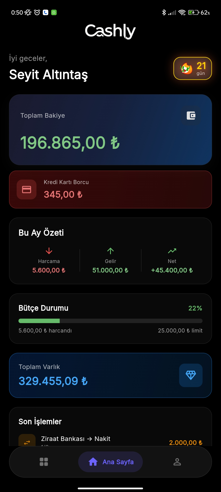
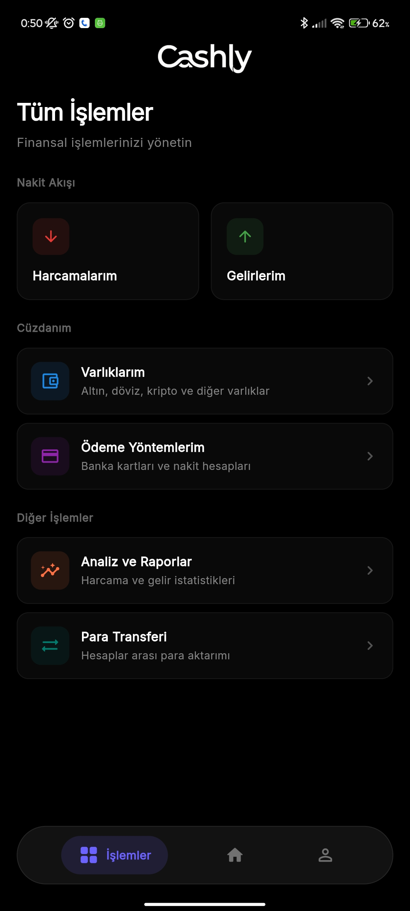
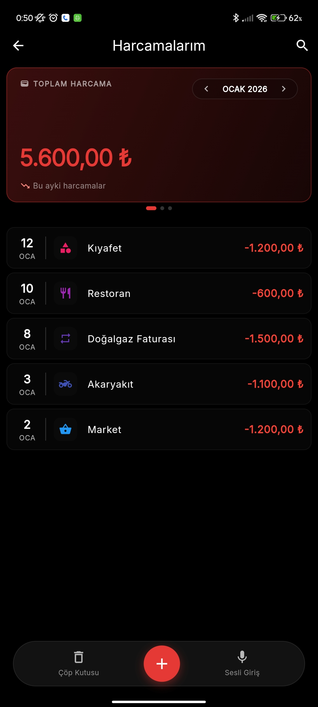
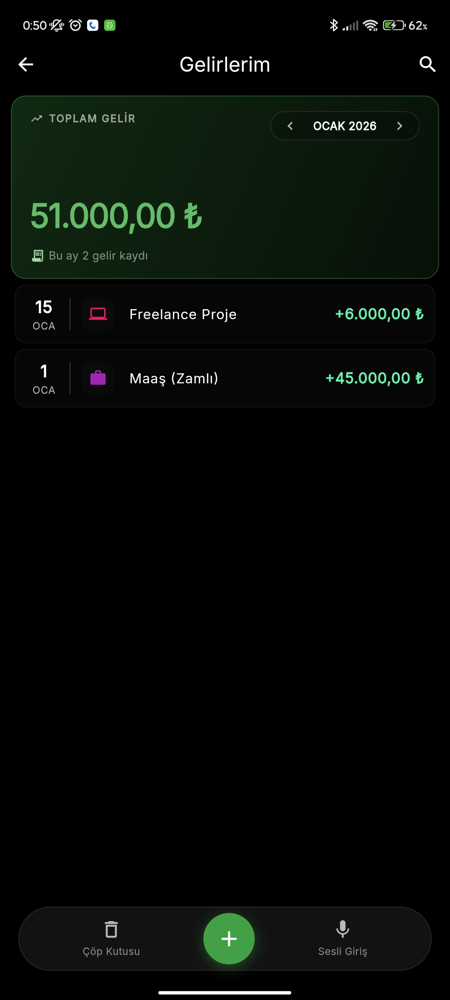
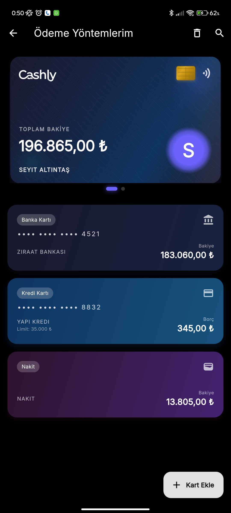
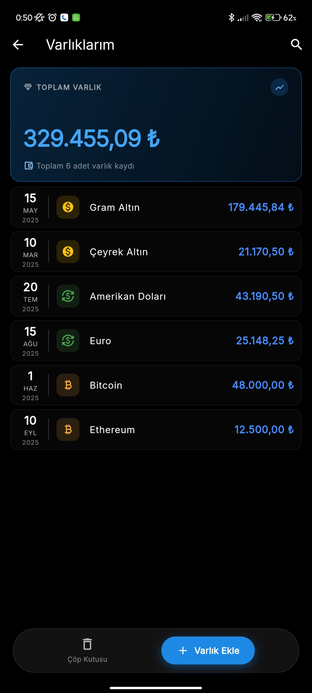
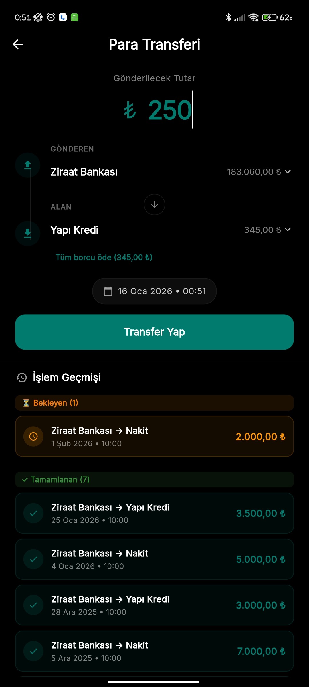
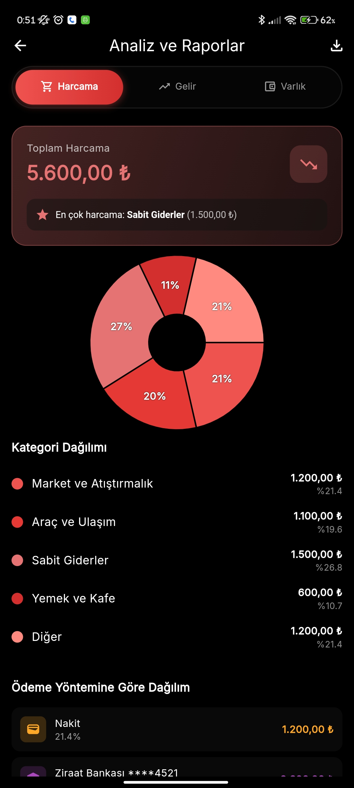

# 💰 Cashly - Kişisel Bütçe Takip Uygulaması

<p align="center">
  
</p>


<p align="center">
  <a href="#"></a>
  <a href="#"></a>
  <a href="#"></a>
  <a href="#"></a>
  <a href="#"></a>
</p>

<p align="center">
  <b>Harcamalarınızı takip edin, bütçenizi yönetin, finansal hedeflerinize ulaşın!</b>
</p>

---

## 📑 İçindekiler

- [Özellikler](#-özellikler)
- [Ekran Görüntüleri](#-ekran-görüntüleri)
- [Kurulum](#-kurulum)
- [Mimari](#️-mimari)
- [Proje Yapısı](#-proje-yapısı)
- [Testler](#-testler)
- [CI/CD](#-cicd)
- [Kullanılan Paketler](#-kullanılan-paketler)
- [Katkıda Bulunma](#-katkıda-bulunma)
- [Lisans](#-lisans)

---

## ✨ Özellikler

### 💳 Finansal Yönetim
| Özellik | Açıklama |
|---------|----------|
| **Harcama Takibi** | Günlük, haftalık, aylık harcama analizi |
| **Gelir Yönetimi** | Gelirlerinizi kategorize edin |
| **Bütçe Limiti** | Aylık bütçe belirleme ve uyarı sistemi |
| **Varlık Takibi** | Nakit, banka, kripto, altın, hisse senedi |
| **Tekrarlayan İşlemler** | Otomatik maaş, kira gibi düzenli gelir/giderler |

### 💳 Ödeme Yöntemleri
- Kredi kartı, banka kartı, nakit yönetimi
- Kart bakiye ve limit takibi
- Hesaplar arası transfer (anlık veya zamanlanmış)

### 🎙️ Sesli Komutlar
- Sesli harcama/gelir ekleme
- Doğal dil işleme desteği
- Text-to-Speech geri bildirim

### 📊 Raporlama & Analiz
- Kategori bazlı pasta ve çubuk grafikler
- Aylık karşılaştırmalı analizler
- PDF rapor dışa aktarma ve paylaşım

### 🔐 Güvenlik
- PIN koruması
- Parmak izi / Yüz tanıma (biyometrik)
- Güvenlik sorusu

### 🎨 Kullanıcı Deneyimi
- Modern ve minimal tasarım
- Karanlık/Aydınlık tema
- Özelleştirilebilir kategoriler ve ikonlar
- Haptic feedback desteği
- Seri (streak) motivasyon sistemi

---

## 📱 Ekran Görüntüleri

<p align="center">
  
  
  
  
</p>

<p align="center">
  
  
  
  
</p>

---

## 🚀 Kurulum

### Gereksinimler

| Gereksinim | Minimum Versiyon |
|------------|------------------|
| Flutter SDK | 3.24+ |
| Dart SDK | 3.10+ |
| Android SDK | API 21+ (Android 5.0) |
| iOS | 12.0+ |

### Hızlı Başlangıç

```bash
# 1. Repository'yi klonla
git clone https://github.com/SeyitAltintas/ButceTakipUygulamasi.git
cd cashly

# 2. Bağımlılıkları yükle
flutter pub get

# 3. Kod analizi (opsiyonel)
flutter analyze

# 4. Testleri çalıştır (opsiyonel)
flutter test

# 5. Uygulamayı çalıştır
flutter run
```

### Build Komutları

```bash
# Android APK
flutter build apk --release

# Android App Bundle (Play Store için)
flutter build appbundle --release

# iOS (macOS gerektirir)
flutter build ios --release
```

---

## 🏛️ Mimari

Proje **Clean Architecture** prensiplerine göre yapılandırılmıştır:

```
┌─────────────────────────────────────────────────────┐
│                  Presentation Layer                  │
│         (Pages, Widgets, Controllers)               │
├─────────────────────────────────────────────────────┤
│                   Domain Layer                       │
│           (Use Cases, Repository Interfaces)        │
├─────────────────────────────────────────────────────┤
│                    Data Layer                        │
│      (Repository Impl, Models, Data Sources)        │
└─────────────────────────────────────────────────────┘
```

### Kullanılan Desenler

| Desen | Açıklama |
|-------|----------|
| **Clean Architecture** | Katmanlı ve test edilebilir yapı |
| **Repository Pattern** | Veri kaynaklarının soyutlanması |
| **Controller Pattern** | UI state yönetimi (ChangeNotifier) |
| **Dependency Injection** | GetIt ile merkezi bağımlılık yönetimi |
| **Feature-First** | Özellik bazlı klasör organizasyonu |

### State Management

- **Provider** - Ana state yönetimi
- **ChangeNotifier** tabanlı Controller'lar
- Her feature kendi controller'ına sahip

### Veritabanı

- **Hive** - Offline-first NoSQL veritabanı
- Tüm veriler cihazda güvenle saklanır
- İnternet bağlantısı gerektirmez

---

## 📁 Proje Yapısı

```
lib/
├── core/                     # 🔧 Ortak bileşenler
│   ├── constants/            # Sabit değerler (renkler, ikonlar)
│   ├── data/repositories/    # Repository implementasyonları
│   ├── di/                   # GetIt Dependency Injection
│   ├── domain/usecases/      # Use Case sınıfları
│   ├── exceptions/           # Özel exception sınıfları
│   ├── extensions/           # Dart extension metodları
│   ├── mixins/               # Mixin'ler (LazyLoading vb.)
│   ├── router/               # go_router navigasyon
│   ├── services/             # 14 servis (network, cache, speech vb.)
│   ├── theme/                # Tema yönetimi
│   ├── utils/                # Yardımcı fonksiyonlar
│   └── widgets/              # 17 paylaşılan widget
│
├── features/                 # 📦 Özellik modülleri (11 adet)
│   ├── analysis/             # Analiz ve grafikler
│   ├── assets/               # Varlık yönetimi
│   ├── auth/                 # Kimlik doğrulama
│   ├── dashboard/            # Ana panel
│   ├── expenses/             # Harcama yönetimi
│   ├── home/                 # Ana sayfa ve navigasyon
│   ├── income/               # Gelir yönetimi
│   ├── payment_methods/      # Ödeme yöntemleri ve transfer
│   ├── settings/             # Ayarlar
│   ├── streak/               # Seri motivasyon sistemi
│   └── tools/                # Araçlar menüsü
│
└── main.dart                 # 🚀 Uygulama giriş noktası

test/
├── unit/                     # Unit testler
├── widget/                   # Widget testler
└── integration_test/         # Entegrasyon testleri
```

### Her Feature Modülünün Yapısı

```
features/expenses/
├── data/
│   ├── models/               # Expense Model
│   └── repositories/         # (opsiyonel)
├── domain/
│   ├── repositories/         # ExpenseRepository interface
│   └── usecases/             # GetExpenses, AddExpense vb.
└── presentation/
    ├── controllers/          # ExpensesController
    ├── pages/                # ExpensesPage, AddExpensePage vb.
    └── widgets/              # ExpenseListItem, ExpenseSummaryCard
```

---

## 🧪 Testler

### Test Komutları

```bash
# Tüm testleri çalıştır
flutter test

# Belirli bir test dosyası
flutter test test/unit/expenses_controller_test.dart

# Coverage raporu ile
flutter test --coverage

# Entegrasyon testleri
flutter test integration_test/
```

### Test İstatistikleri

| Kategori | Dosya Sayısı | Açıklama |
|----------|--------------|----------|
| **Unit Tests** | 13 | Controller, service ve util testleri |
| **Widget Tests** | 17 | Core widget testleri |
| **Integration Tests** | 3 | Uygulama akış testleri |
| **Toplam** | **262+ test** | ✅ Tümü geçiyor |

---

## 🔄 CI/CD

GitHub Actions ile otomatik pipeline:

| Adım | Tetikleyici | Açıklama |
|------|-------------|----------|
| ✅ Kod Analizi | Her push/PR | `flutter analyze` |
| ✅ Testler | Her push/PR | `flutter test` |
| ✅ APK Build | `[build]` commit msg | Release APK oluşturur |

### Workflow Dosyası

```yaml
# .github/workflows/flutter.yaml
name: Flutter CI
on: [push, pull_request]
jobs:
  build:
    runs-on: ubuntu-latest
    steps:
      - uses: actions/checkout@v4
      - uses: subosito/flutter-action@v2
      - run: flutter pub get
      - run: flutter analyze
      - run: flutter test
```

---

## 📦 Kullanılan Paketler

### Ana Bağımlılıklar

| Paket | Versiyon | Kullanım |
|-------|----------|----------|
| `provider` | ^6.1.5 | State yönetimi |
| `get_it` | ^7.6.7 | Dependency Injection |
| `hive_flutter` | ^1.1.0 | Yerel veritabanı |
| `go_router` | ^14.8.1 | Navigasyon |
| `fl_chart` | ^0.65.0 | Grafikler |
| `speech_to_text` | ^7.0.0 | Sesli komutlar |
| `flutter_tts` | ^4.2.0 | Text-to-Speech |
| `local_auth` | ^2.3.0 | Biyometrik kimlik |
| `pdf` | ^3.11.1 | PDF oluşturma |
| `share_plus` | ^12.0.1 | Paylaşım |
| `lottie` | ^3.3.1 | Animasyonlar |
| `connectivity_plus` | ^6.1.4 | Ağ durumu |

### Geliştirme Bağımlılıkları

| Paket | Kullanım |
|-------|----------|
| `flutter_test` | Test framework |
| `flutter_lints` | Lint kuralları |
| `integration_test` | Entegrasyon testleri |
| `mockito` | Mock nesneler |

---

## 🤝 Katkıda Bulunma

Katkılarınız memnuniyetle karşılanır! 

### Adımlar

1. **Fork** yapın
2. Feature branch oluşturun
   ```bash
   git checkout -b feature/amazing-feature
   ```
3. Değişikliklerinizi commit edin
   ```bash
   git commit -m 'feat: amazing feature eklendi'
   ```
4. Branch'i push edin
   ```bash
   git push origin feature/amazing-feature
   ```
5. **Pull Request** açın

### Commit Mesaj Formatı

```
<tür>: <açıklama>

Türler:
- feat: Yeni özellik
- fix: Hata düzeltmesi
- docs: Dokümantasyon
- style: Kod formatı
- refactor: Kod iyileştirmesi
- test: Test ekleme
- chore: Bakım işlemleri
```

### Kod Standartları

- `flutter analyze` hata döndürmemeli
- `flutter test` tüm testler geçmeli
- Yeni özellikler için test yazılmalı
- Türkçe yorum satırları kullanılmalı

---

## 📄 Lisans

⚠️ **Tüm Haklar Saklıdır (All Rights Reserved)**

Bu proje ve kaynak kodları yalnızca **eğitim ve portföy** amaçlı paylaşılmıştır.

- ❌ Kopyalama, çoğaltma veya dağıtma **yasaktır**
- ❌ Kaynak kodun herhangi bir kısmını kullanma **yasaktır**
- ❌ Ticari veya ticari olmayan amaçlarla kullanım **yasaktır**

Detaylar için [LICENSE](LICENSE) dosyasına bakın.

---

## 📞 İletişim

- **Geliştirici:** Seyit Altıntaş
- **GitHub:** [@SeyitAltintas](https://github.com/SeyitAltintas)

---

<p align="center">
  Made with ❤️ using Flutter
</p>
